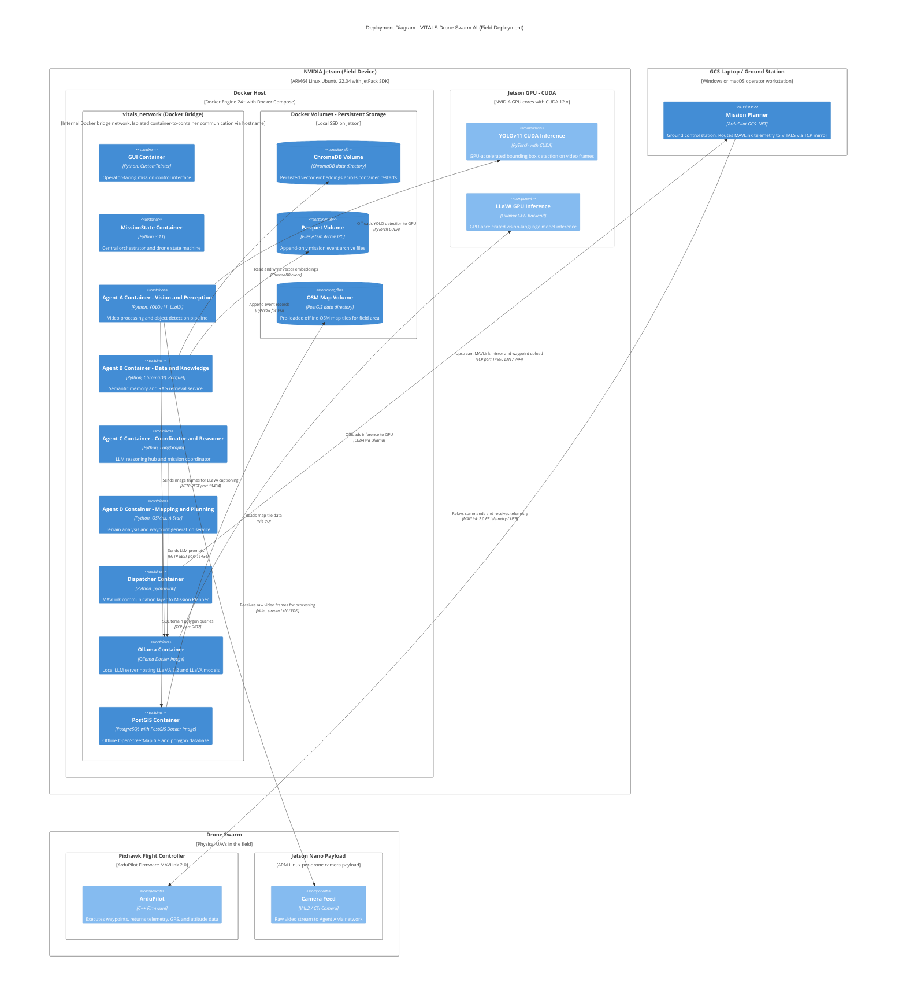

# VITALS — C4 Deployment Diagram

> **Audience:** DevOps, hardware integration leads, Lockheed Martin technical reviewers.
> **Purpose:** Shows where VITALS containers run physically — the Jetson hardware, Docker environment, and network topology.
> **C4 Rule:** Use Deployment Nodes to represent infrastructure. Containers are instances of the software containers from Level 2.

## Deployment Topology Summary

| Node | Hardware | Purpose |
|---|---|---|
| NVIDIA Jetson (Field) | ARM64 + NVIDIA GPU | Runs all VITALS Docker containers during field operations |
| Docker Bridge Network | Software (internal) | Isolated container communication; no external port exposure |
| GCS Laptop | Operator workstation | Runs Mission Planner; TCP mirrors MAVLink to VITALS |
| Drone Swarm | Physical UAVs | Execute waypoints; stream video and telemetry |
| Pixhawk (per drone) | ArduPilot controller | MAVLink endpoint; waypoint execution |
| Jetson Nano Payload | Per-drone Jetson | Camera capture and video stream to Agent A |

## Port Reference

| Service | Port | Protocol |
|---|---|---|
| Mission Planner MAVLink mirror | 14550 | TCP |
| Ollama LLM API | 11434 | HTTP REST |
| PostGIS / PostgreSQL | 5432 | TCP (SQL) |
| Docker container-to-container (vitals_network) | Internal only | HTTP / JSON |
