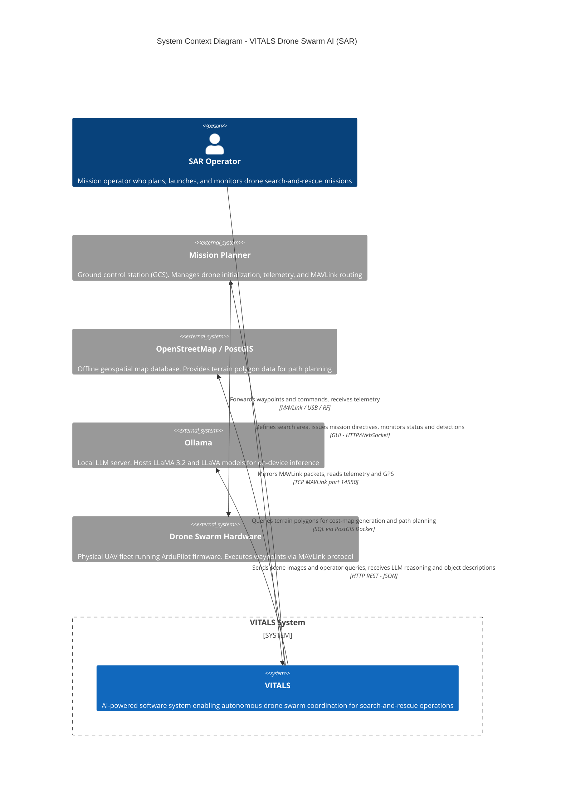

# VITALS — C4 Level 1: System Context Diagram

> **Audience:** Everyone — technical and non-technical stakeholders, sponsors (Lockheed Martin), SAR operators.
> **Purpose:** Defines what VITALS is, who uses it, and which external systems it depends on.
> **C4 Rule:** Show the system as a single box. Do NOT show internals. Label every relationship with *what* and *how*.

## Element Descriptions

| Element | Type | Description |
|---|---|---|
| SAR Operator | Person | The human user who controls the mission via the VITALS GUI |
| VITALS | Software System | The system under design — orchestrates agents, processes video, plans paths |
| Mission Planner | External Software System | ArduPilot GCS acting as MAVLink router between VITALS and drones |
| Ollama | External Software System | On-device LLM server; never calls external cloud APIs |
| OpenStreetMap / PostGIS | External Software System | Offline map database containerized locally for field operations |
| Drone Swarm Hardware | External System | Physical UAVs; not owned or developed by VITALS team |
