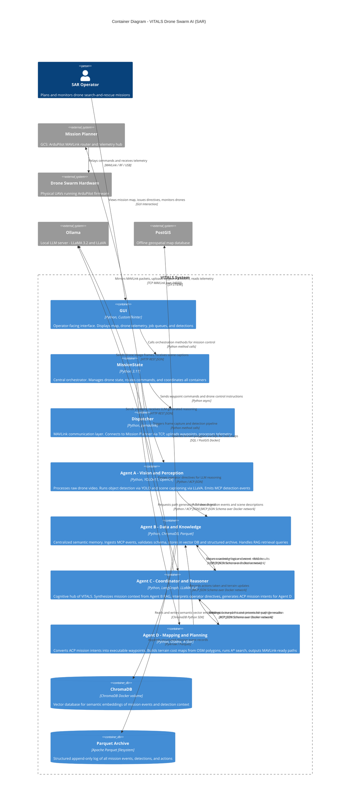

# VITALS — C4 Level 2: Container Diagram

> **Audience:** Developers, DevOps, technical leads, Lockheed Martin engineering sponsors.
> **Purpose:** Shows the major deployable units (Docker containers) inside VITALS, their technologies, and how they communicate.
> **C4 Rule:** Every container must show: Name, [Technology], and a short description. Label every relationship with protocol/format.

## Container Inventory

| Container | Technology | Responsibility | Agent Role |
|---|---|---|---|
| GUI | Python, CustomTkinter | Operator interface: map, telemetry, jobs | — |
| MissionState | Python 3.11 | Central orchestrator, state machine | — |
| Agent A — Vision & Perception | YOLOv11, LLaVA, OpenCV | Object detection + scene captioning from drone video | A |
| Agent B — Data & Knowledge | ChromaDB, Parquet | Semantic memory, event storage, RAG retrieval | B |
| Agent C — Coordinator & Reasoner | LangGraph, LLaMA 3.2 | Mission reasoning, intent generation | C |
| Agent D — Mapping & Planning | OSMnx, A* | Terrain cost maps, waypoint generation | D |
| Dispatcher | pymavlink | MAVLink protocol bridge to Mission Planner | — |
| ChromaDB | ChromaDB | Vector database (persistent Docker volume) | B (storage) |
| Parquet Archive | Apache Parquet | Structured event log archive | B (storage) |

## Protocol Glossary

| Protocol | Full Name | Usage |
|---|---|---|
| MCP | Message Communication Protocol | Standardized JSON Schema events: facts, detections, queries, logs |
| ACP | Agent Communication Protocol | Action-oriented JSON Schema intents: planning requests, mission coordination |
| MAVLink | Micro Air Vehicle Link | Drone waypoint upload, telemetry reception |
