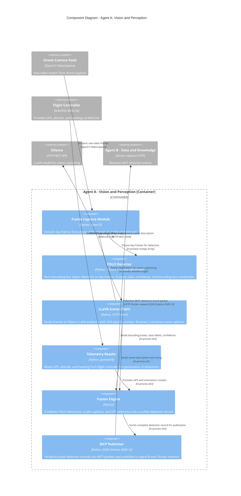
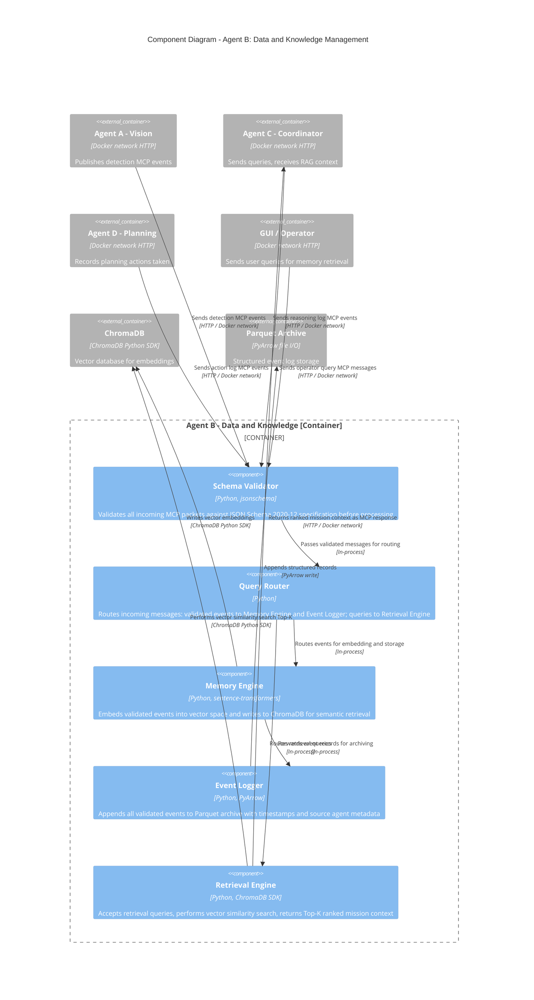
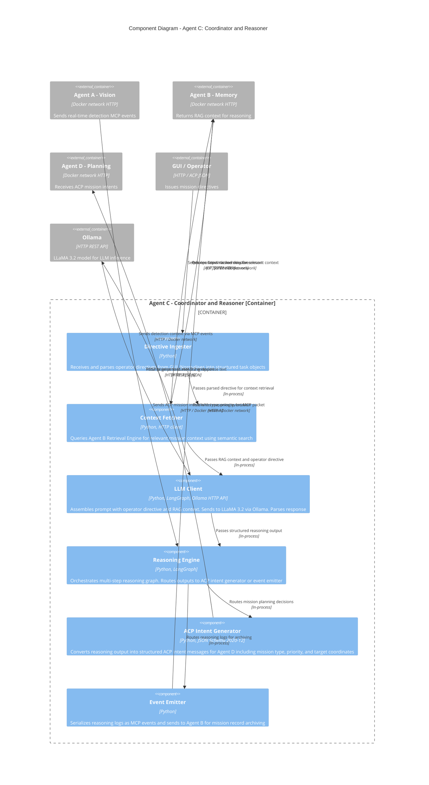
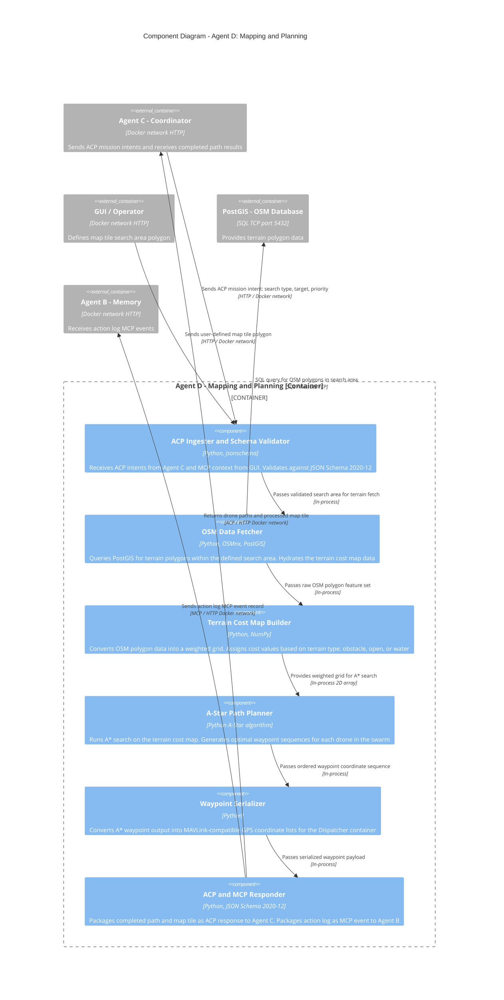

# VITALS — C4 Level 3: Component Diagrams

> **Audience:** Developers working inside each agent container.
> **Purpose:** Shows the internal components of each container, their responsibilities, and how they connect.
> **C4 Rule:** Components are not separately deployable — they are logical groupings inside a container (classes, modules, subsystems).

---

## Agent A — Vision & Perception (Component Diagram)

---

## Agent B — Data & Knowledge (Component Diagram)

---

## Agent C — Coordinator & Reasoner (Component Diagram)

---

## Agent D — Mapping & Planning (Component Diagram)

